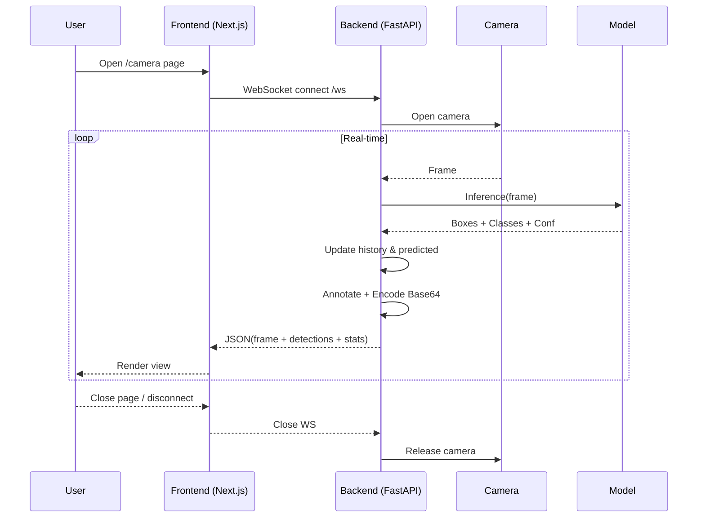

# Eye Detection System Flow Diagrams

เอกสารนี้สรุปขั้นตอนการทำงานของระบบปัจจุบัน (Backend FastAPI + YOLO + WebSocket Streaming) ทั้งในมุมมองระดับระบบและระดับวงรอบประมวลผลเฟรม พร้อมทั้ง Diagram ในรูปแบบ Mermaid ที่สามารถ Render ได้ทันทีใน Markdown viewer ที่รองรับ

---
## 1. System Level Flow
```
Start
  |
  v
ผู้ใช้เปิดหน้าเว็บ (/camera)
  |
  v
Frontend เปิด WebSocket ไปยัง Backend /ws
  |
  v
Backend Accept การเชื่อมต่อ
  |
  v
เปิดกล้อง (VideoCapture(0)) สำเร็จ?
  |----------------------|
  |Yes                   |No
  v                      v
เข้าสู่ Loop เฟรม       ส่ง error + ปิดการเชื่อมต่อ + End
  |
  v
(ดู Frame Processing Loop)
  |
  v
Client ปิด / Error เกิดขึ้น
  |
  v
Release กล้อง & ปิด WebSocket
  |
  v
End
```

### Mermaid Version (System Level)


---
## 2. Frame Processing Loop Flow
```
(Loop Start)
  |
  v
อ่านเฟรมจากกล้อง สำเร็จ?
  |----------------------|
  |Yes                   |No -> Break (ออกจาก Loop)
  v
YOLO Inference บนเฟรม
  |
  v
สร้าง Annotated Frame (plot)
  |
  v
Extract Detections (boxes, conf, cls)
  |
  v
ลบ history ที่เก่ากว่า 10 วินาที
  |
  v
เพิ่ม cls ปัจจุบันลง history
  |
  v
history ว่าง?
  |----------------------|
  |Yes                   |No
  v                      v
predicted = ""      predicted = most common label
  |
  v
คำนวณ latency / fps / log
  |
  v
เข้ารหัส annotated frame -> JPEG -> Base64
  |
  v
ประกอบ JSON payload (frame, detections, fps, latency, log, predicted)
  |
  v
ส่งผ่าน WebSocket สำเร็จ?
  |----------------------|
  |Yes                   |No -> Break (ออกจาก Loop)
  v
sleep ~30ms
  |
  v
วนกลับไปอ่านเฟรมใหม่ (ต่อเนื่อง)
```

### Mermaid Version (Frame Loop)
```mermaid
flowchart TD
    L1([Frame Loop Start]) --> L2[Read frame]
    L2 --> L3{Read OK?}
    L3 -->|No| L99([Break Loop])
    L3 -->|Yes| L4[YOLO Inference]
    L4 --> L5[Create annotated frame]
    L5 --> L6[Extract detections]
    L6 --> L7[Prune old history (>10s)]
    L7 --> L8[Append current classes]
    L8 --> L9{History empty?}
    L9 -->|Yes| L10[predicted = empty]
    L9 -->|No| L11[predicted = most common]
    L10 --> L12[Compute latency / fps / log]
    L11 --> L12
    L12 --> L13[Encode frame -> Base64]
    L13 --> L14[Build JSON payload]
    L14 --> L15{Send OK?}
    L15 -->|No| L99
    L15 -->|Yes| L16[sleep 30ms]
    L16 --> L2
```

---
## 3. Sequence Diagram (End-to-End Streaming)


---
## 4. Payload Structure (ปัจจุบัน)
```jsonc
{
  "frame": "<Base64 JPEG>",
  "detections": [
    {"x1": float, "y1": float, "x2": float, "y2": float, "conf": float, "cls": int}
  ],
  "fps": number,
  "latency": milliseconds,
  "log": "Detected: ...",
  "predicted": "<label or empty>"
}
```

---
## 5. ข้อเสนอแนะเพิ่มเติม (Optional Improvements)
- รองรับหลายผู้ใช้ด้วย session object แทน global state
- เพิ่ม timestamp (UTC ISO8601) ใน payload
- แยกกล้องเป็น input แบบ client-side (WebRTC) หากต้องการ scale
- ลดขนาดภาพก่อนส่ง (resize + quality tune)
- เพิ่ม auth / token ในการเปิด WebSocket
- แยก worker inference เพื่อไม่บล็อก event loop

---
## 6. Mermaid Source Files
ไฟล์แยกสำหรับแก้ไขง่าย:
- `docs/diagrams/system_flow.mmd`
- `docs/diagrams/frame_loop.mmd`
- `docs/diagrams/sequence.mmd`

## 7. การ Export เป็น PNG
ติดตั้ง Mermaid CLI (ขอแนะนำให้ global หรือ dev dependency ที่ root แยกจาก frontend ถ้าไม่อยากปนกับ Next.js) วิธีง่าย:

### ตัวเลือก A: ใช้ npx (ครั้งคราว)
```powershell
npx -y @mermaid-js/mermaid-cli -i docs/diagrams/system_flow.mmd -o docs/diagrams/system_flow.png
npx -y @mermaid-js/mermaid-cli -i docs/diagrams/frame_loop.mmd -o docs/diagrams/frame_loop.png
npx -y @mermaid-js/mermaid-cli -i docs/diagrams/sequence.mmd -o docs/diagrams/sequence.png
```

### ตัวเลือก B: ติดตั้งเป็น dev dependency (แนะนำ)
สร้าง/เพิ่ม `package.json` ระดับ root หรือใช้ของ frontend ก็ได้ แต่ควรแยกเพื่อไม่ให้ next build ดึงไปโดยไม่จำเป็น

ตัวอย่าง (ใช้ของ frontend เดิม):
```powershell
cd frontend
npm install -D @mermaid-js/mermaid-cli
```
เพิ่ม script ใน `frontend/package.json`:
```jsonc
"scripts": {
  // ...existing scripts
  "diagram:system": "mmdc -i ../docs/diagrams/system_flow.mmd -o ../docs/diagrams/system_flow.png",
  "diagram:loop": "mmdc -i ../docs/diagrams/frame_loop.mmd -o ../docs/diagrams/frame_loop.png",
  "diagram:seq": "mmdc -i ../docs/diagrams/sequence.mmd -o ../docs/diagrams/sequence.png",
  "diagram:all": "npm-run-all diagram:*"
}
```
(หากไม่มี npm-run-all ให้ติดตั้งเพิ่ม: `npm i -D npm-run-all` หรือใช้ PowerShell wildcard: `npm run diagram:system; npm run diagram:loop; npm run diagram:seq`)

### ตัวเลือก C: ใช้ Docker (ถ้าต้องการ reproducible)
```powershell
docker run --rm -v ${PWD}:/work minlag/mermaid-cli mmdc -i /work/docs/diagrams/system_flow.mmd -o /work/docs/diagrams/system_flow.png
```

## 8. หมายเหตุคุณภาพภาพ
- สามารถเพิ่มความละเอียดด้วย flag `-w 1800` (หรือ `-b transparent` สำหรับพื้นหลังโปร่งใส)
- ใส่ธีม: `-t forest` หรือสร้าง theme config แยก

ตัวอย่าง:
```powershell
npx -y @mermaid-js/mermaid-cli -i docs/diagrams/system_flow.mmd -o docs/diagrams/system_flow.png -w 1600 -t forest
```

---
หากต้องการให้ผมเพิ่ม script ลงใน `frontend/package.json` ตอนนี้ แจ้งได้เลยครับ หรือถ้าต้องการสร้าง root package.json แยกสำหรับ docs ก็ทำได้เช่นกัน
